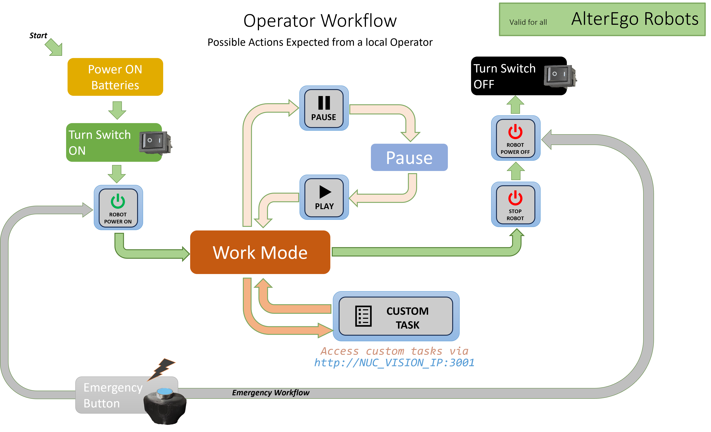
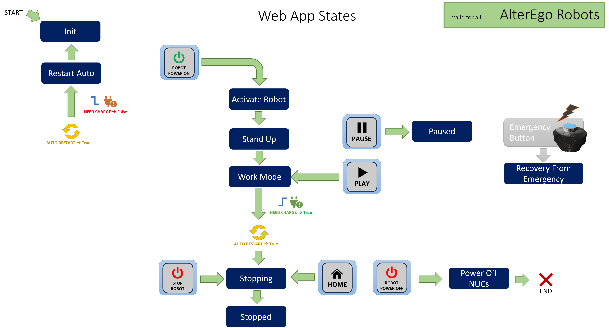
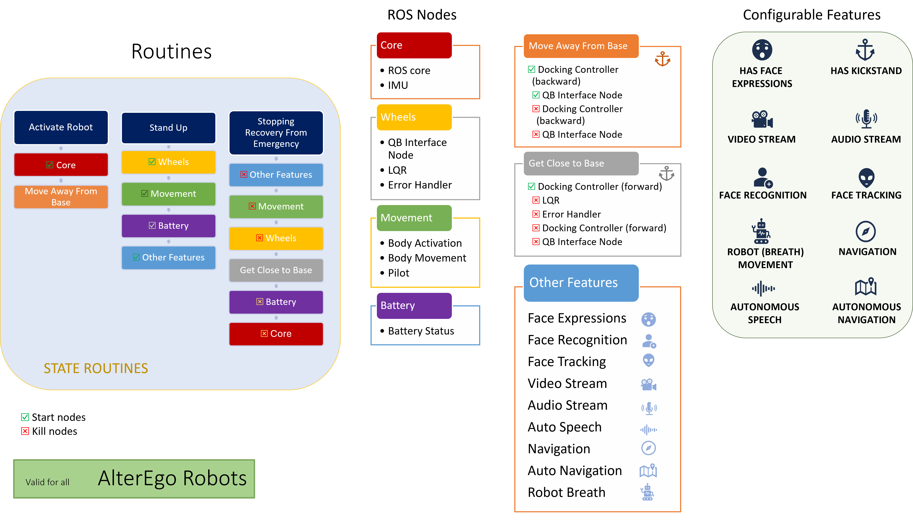

# AlterEGO Web Application

## Overview
The AlterEGO Web Application is a web-based control panel designed to manage and monitor the AlterEGO robotic system. This application provides a user-friendly interface for interacting with the robot's functionalities.

It is intended to deal with the following operator workflow:



## Project Structure
```
alterego-webapp
├── src
│   ├── index.html               # Main HTML entry point
│   ├── js
│   │   ├── constants.js         # Constants used throughout the application
│   │   ├── utils.js             # Utility functions for data manipulation
│   │   ├── api.js               # Functions for making API calls
│   │   ├── battery_monitor.js   # Functions to check battery changes
│   │   ├── workflow.js          # Functions to handle the whole workflow
│   │   └── main.js              # Main JavaScript file for initialization
│   ├── css
│   │   └── main.css             # Styles for the web application
│   ├── components
│   │   ├── status-panel.html    # HTML structure for the status panel
│   │   └── button-grid.html     # HTML structure for the button grid
│   └── custom_tasks
│       ├── task-index.html      # Main HTML entry point for Custom Tasks page
│       ├── tasks.js             # Functions to handle custom tasks buttons
│       └── customTasks.js       # HTML structure to edit to customize Tasks actions
│
├── package.json                 # npm configuration file
└── README.md                    # Project documentation
```

## Setup Instructions
1. Clone the repository:
   ```
   git clone <repository-url>
   ```

2. Install the dependencies:
   ```
   sudo apt install nodejs npm
   
   sudo apt update
   
   sudo apt install nginx -y
   
   curl -o- https://raw.githubusercontent.com/nvm-sh/nvm/v0.40.3/install.sh | bash
   ```

   Close and reopen terminal, then type
   ```
   nvm install lts/jod
   ```
   Check the version of nodejs (v22.17.0) and npm (10.9.2) corresponds
   ```
   node -v
   
   npm -v
   ```

3. Navigate to the project directory and install node modules:
   ```
   cd alterego-webapp

   npm install
   ```

4. Configure server file

   - Open and modify the file
   ```
   sudo nano /etc/nginx/sites-available/default
   ```
   - Comment everything and add the following lines
   ```
   server {
      listen 80;
      server_name localhost;

      location / {
         proxy_pass http://localhost:3000; # Cambia con la porta della tua web app
         proxy_set_header Host $host;
         proxy_set_header X-Real-IP $remote_addr;
         proxy_set_header X-Forwarded-For $proxy_add_x_forwarded_for;
      }
   }
   ```
   - Save and close Nano editor (CTRL+X, then Y option)

5. Restart nginx
   ```
   sudo systemctl restart nginx
   ```

6. Modify _start-alterego-webapp.sh_ bash script file
   - Open the file and modify _APP_DIR_ row to match _alterego_webapp_ folder path (if needed)
      ```
      APP_DIR="/home/alterego-vision/catkin_ws/src/AlterEGO_v2/alterego_webapp"
      ```
   - Open a terminal window and modify permissions to allow execution of the script with the command
      ```
      chmod 775 start-alterego-webapp.sh
      ```

7. Create startup file
   - Open a terminal window in the folder _~/.config/autostart_ , create the file and open it to edit:
      ```
      touch alterego-webapp.desktop
      nano alterego-webapp.desktop
      ```
   - Copy and paste the following content:
      ```
      [Desktop Entry]
      Type=Application
      Exec=/home/alterego-vision/catkin_ws/src/AlterEGO_v2/alterego_webapp/start-alterego-webapp.sh
      Icon=/home/alterego-vision/catkin_ws/src/AlterEGO_v2/alterego_webapp/src/images/logo.png
      Hidden=false
      NoDisplay=false
      Terminal=false
      Categories=Utility
      X-GNOME-Autostart-enabled=true
      X-GNOME-Autostart-Delay=10
      Name[en_US]=AlterEGO Web App
      Name=AlterEGO Web App
      Comment[en_US]=Start AlterEGO WebAPP and GUI
      Comment=Start AlterEGO WebAPP and GUI
      ```
   - Modify the _Exec_ and _Icon_ rows to match _alterego_webapp_ folder path (if needed)
   - Save and close Nano editor (CTRL+X, then Y option)

   - Install startup file
      ```
      sudo desktop-file-install alterego-webapp.desktop
      ```
      In case you need to manage it later, this will install the shortcut in the default directory _/usr/share/applications_

   - Add the app to sidebar for quick access
      - In the _Activities_ Overview in Ubuntu, search for "_AlterEgo Web App_", right click on the icon and "_Add to favorites_" to show it on the sidebar


## Startup
The web app is **automatically executed at startup** after a small delay.
If it's closed, it can be reopened through the shortcut on the sidebar.

Alternatively, you can open it through the following commands executed on separate terminals:
   - Terminal 1:
      ```
      node ~/catkin_ws/src/AlterEGO_v2/alterego_webapp/src/webapp.js
      ```
   - Terminal 2:
      ```
      firefox --kiosk http://localhost:3000
      ```

## Usage
Operator actions are exclusively through buttons that allow the robot to operate between the following states:



Each state manages the activation/deactivation of the mandatory and additional robot ROS nodes. At the moment the list of executed routines and configurable feaures is resumed here:



**Custom tasks** can be accomplished by accessing the additional web page at http://192.168.88.xx:3001 within the _"AlterEgo Net"_ network, where **xx** is the last part of the Vision NUC IP address on the wired network.

## Contributing
Contributions are welcome! Please submit a pull request or open an issue for any enhancements or bug fixes.

## License
This project is licensed under the BSD-3 License. See the LICENSE file for more details.
